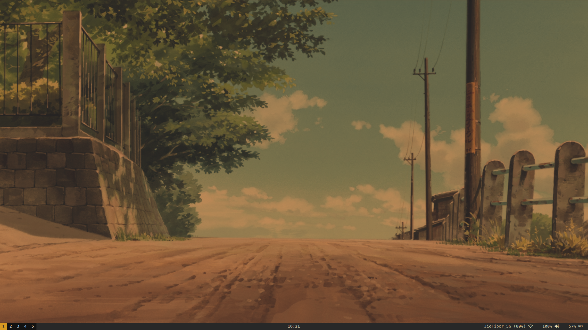
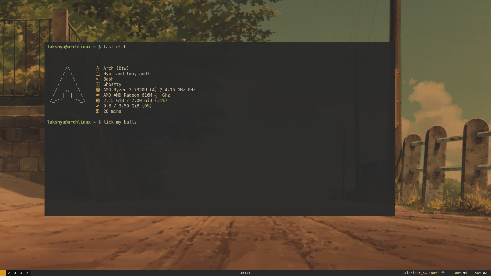
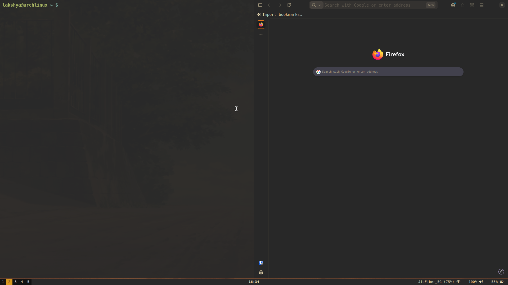

# ❄️ My Hyprland Dotfiles

My personal Hyprland configuration files. This setup focuses on a pure productive.

## 🔑 Key feature
* No animation, however it can be turned on by going to the hypr/hyprland.conf
* Gruvbox theme
* Minimalistic look
 
## 🖥️ System Overview
* **WM:** Hyprland
* **Bar:** Waybar
* **Terminal:** Ghostty 
* **Launcher:** Fuzzel
* **Wallpaper Daemon:** Hyprpaper
* **Text editor:** Vim / Neovim 
* **Fetch:** Fastfetch 
* **Lock screen:** Hyprlock 
* **Idle manager:** Hypridle 

## 🚀 Installation & Setup
If you want to replicate this setup on a fresh install, follow these steps:

1. **Install core dependencies:**
Hyprland, Waybar, Ghostty, Fuzzel, Hyprpaper, Vim / Neovim, Fastfetch, Hyprlock, Hypridle

## Sources
Wallpaper - https://gruvbox-wallpapers.pages.dev/ 

## Screenshots

